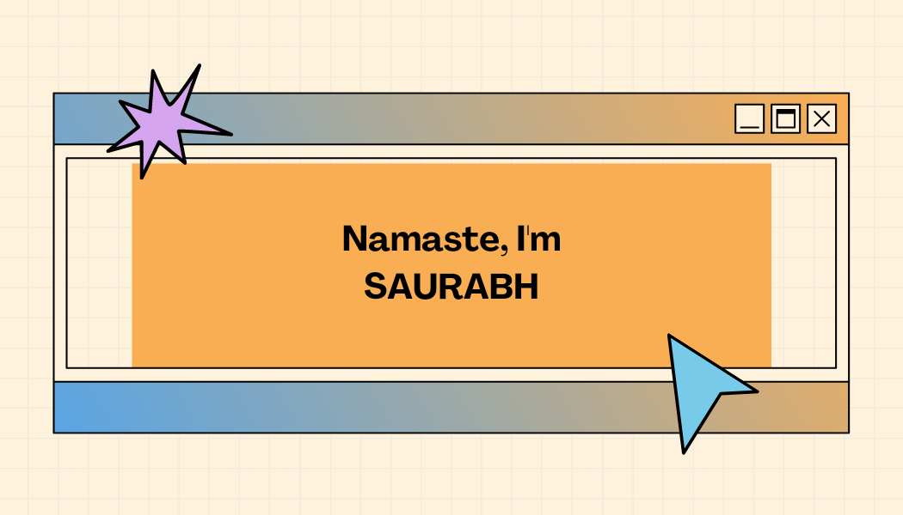

# khairnar Saurabh

Hey there 👋

- I’m Khairnar Saurabh, a aspiring full-stack web developer, creative coder. I'm dedicated to the my work and always seeks for challanges to be solved. 
- Reading books (history || personal development || Investment), listening to a good music and going out for trakking are my hobbies.

## Connect with me 
- [Twitter](https://twitter.com/aka__sawy)
 

## Tech's

<!-- HTML5 logo -->
<a href='#'>
<!-- CSS3 logo -->

<!-- bootstrap -->
</a>
<!-- C++ logo -->

<!-- Python logo -->

<!-- JS logo -->

<!-- Ts logo -->

  
<!-- django logo -->

<!-- MongoDB logo -->

<!-- ExpressJs logo -->

<!-- AngularJs logo -->

<!-- Nodejs logo -->

<!-- MmySql Logo -->
  

  
<b>Testing</b>

  
<b>OS</b> 

# Github Stat's :sunglasses:

